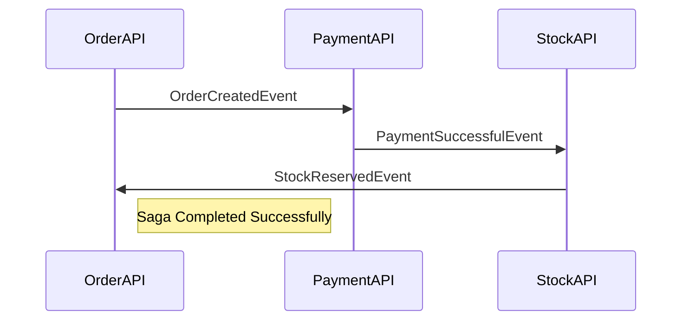
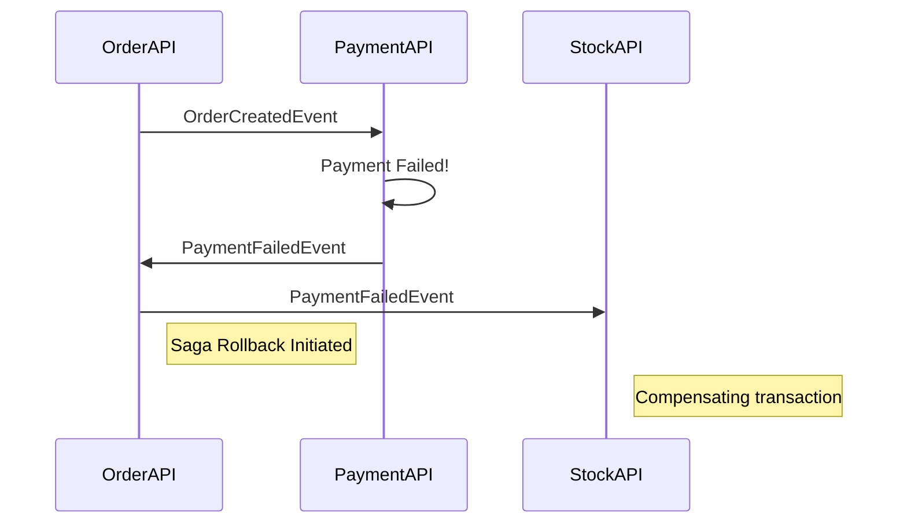

# Microservices-SagaPattern-Choreography

This repository demonstrates the **Saga Pattern's Choreography approach** for managing distributed transactions in a microservices architecture. The project's goal is to showcase how to maintain data consistency in a decentralized system without a central orchestrator.

In this model, each service performs its local transaction and then publishes an event to trigger the next service in the workflow. This creates a loosely coupled system where services are not directly aware of each other. If any step in the transaction chain fails, the Saga pattern executes compensating transactions to undo the changes made by previous steps, ensuring data integrity.

## Project Structure

The project is a blank solution containing three core microservices and a shared library:

  - **OrderAPI**: Initiates the main business flow, such as creating an order.
  - **PaymentAPI**: Manages payment transactions.
  - **StockAPI**: Handles stock updates and reservations.
  - **Shared**: Contains shared DTOs (Data Transfer Objects) and event definitions used for inter-service communication.

## Saga Choreography Flow

The following diagrams illustrate the core concepts of the Saga Choreography pattern as implemented in this project.

### 1\. Successful Transaction (Commit)

A successful transaction begins with an order being created, which triggers a chain of events. All services successfully process their part of the transaction, leading to a final committed state.

\

### 2\. Failed Transaction (Rollback)

In case of a failure in any service, the Saga pattern initiates a rollback. A failure event is published, and other services listen for this event to execute their compensating actions, ensuring the system returns to a consistent state.

### 3\. Database State

The `NodeStateTBL` is used to track the state of each transaction across the services, ensuring visibility and enabling recovery in case of failures. The table records which nodes (services) are part of a transaction and their current state.

## Technologies Used

  - **.NET 8**: The primary development platform.
  - **MassTransit**: A distributed application framework that simplifies working with message brokers.
  - **RabbitMQ**: The message broker used for asynchronous communication.
  - **MongoDB**: A NoSQL database used to persist data for each service.
  - **Docker**: Used to run RabbitMQ and MongoDB in a local development environment.
  - **Git**: Version control for the project, with a recent commit marking the completion and finalization of the project.
